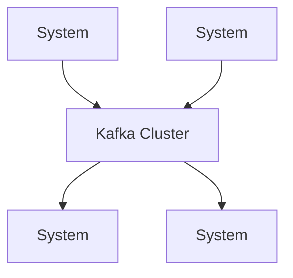
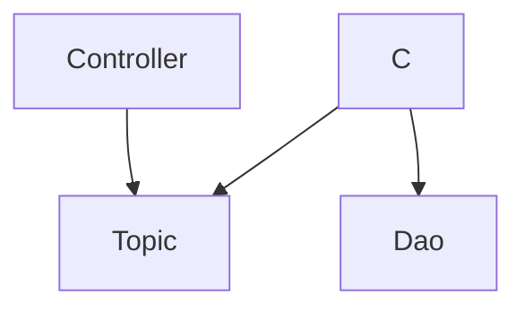

# Synchronous Client-Server Model
接口实现能分离，但是接口不变
实例就一个可能爆炸，没buffer

+ tightly coupled
+ no delivery guarentees
+ software speciation
+ without a request buffer
+ too much emphasis on requests and responses
+ Communication is not replayable

紧耦合而且比较脆弱

# Asynchronous Model





+ Controller: 从Request中获取信息，变成消息给到Topic
+ Service：从Topic中获取信息，变成对象

怎么知道最终处理完呢？

+ 再发ajax
+ WebSocket，服务器主动通知
+ 推到B Topic，客户端从B拿看

异步的返回值应该是什么？

### What is Messaging?
+ Peer-to-peer facility
+ Client can send & receive from any other client
+ Client connects to messaging agent

### 应用场景
+ 有忙有闲，请求数波动很大
+ 谁处理，怎么处理对客户端无关（松散耦合）

JMS(Java 消息服务) API，有不同的实现

+ 消息的格式
	+ A header
	+ Properties: Client can extend the fields
			+ Property name（用于筛选）
			+ Property value（用于筛选）
	+ A Body

```
+ Header
	+ JMSDestination（S）：往哪里发
	+ JMSDeliveryMode（S）：发送的模式
		+ 持久性，存到Kafka重发
		+ 不要就扔。保证发送时序，减轻Kafka压力。如股票交易
	+ JMSMessageID（S）
	+ JMSTimestamp（S）
	+ JMSCorrelationID（C）
	+ JMSReplyTO（C）：往哪里回
	+ JMSRedelivered（P）：有无转发过
	+ JMSType：什么东西放进去？
	+ JMSExpiration（S）：过期时间
	+ JMSPriority（S）
+ Properties
	+ JMSXUserID
	+ JMSXAppID
	+ JMSXDeliveryCount
	+ JMSXGroupID
+ Body
	+ Message Type
		+ TextMessage: A java.lang.String Object
		+ MapMessage
		+ BytesMessage
		+ StreamMessage
		+ ObjectMessage: A Serializable Object in Java
		+ Message
```

### Messaging Styles
+ P2P：点对点
+ `publish/subscribe` product or application
	+ 消息有多个消费者


Tomcat 的 JMS
+ Connection Factory
```
import javax.naming.*;
import javax.jms.*;
QueueConnectionFactory queueConnectionFactory;
```
+ Destination
```

```

```java
JMSContext context = connectionFactory.createContex()

JMSProducer producer = context.createProducer();
context.createProducer().send(dest, message)

JMSConsumer consumer = context.createConsumer(dest);
Message m = consumer.receive();
```

+ Create a message
```java
TextMessage message = context.createTextMessage(); 
message.setText(msg_text); // msg_text is a String 
context.createProducer().send(message);

Message m = consumer.receive();
if (m instanceof TextMessage) {
 String message = m.getBody(String.class);
 System.out.println("Reading message: " + message);
} else {
 // Handle error or process another message type 
}
```

Message Listener: as handler
```java
Listener myListener = new Listener(); 
consumer.setMessageListener(myListener);

Listener:
	void onMessage(Message inMessage)
```

```
String selector;

```

+ Durable Subscription

How are streams stored?

# Topics & Partitions
+ Kafaka分区（Partition）