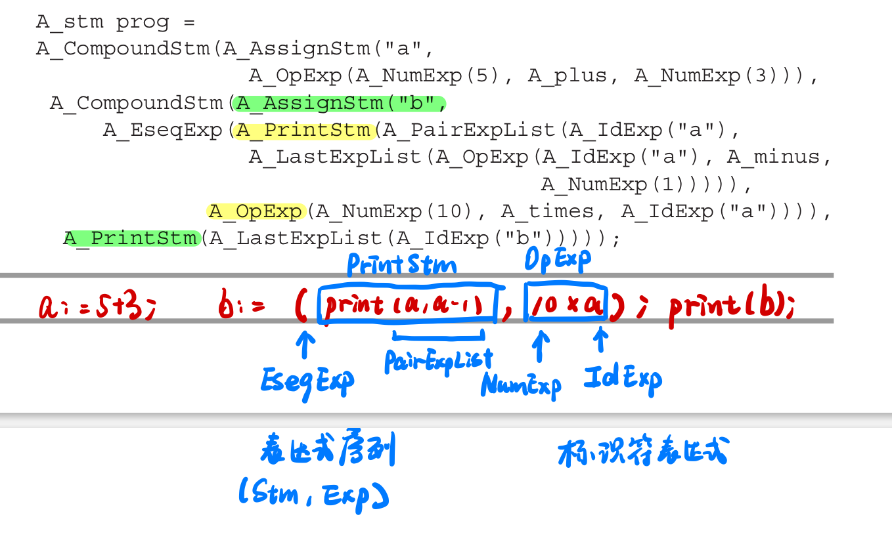

# Languages

- object-oriented with dynamic methods
- functional language with nested scope & function closures
- garbage collection

# Phases of a compiler


- Each phase is implemnted as software modules
- Interfaces
  - Data Structures
    - Abstranct Syntax(Parsing Actions-> Semantic analysis)
    - IR Trees
    - Assem
    - Translate interface is a set of functions that the Semantic Analysis phase can call
    - Tokens interface takes the form of a function that the Parser calls to get the next token of the input program.


- Context-Free Grammar（文法）, for parsing
  - Yacc & Lex
  - converts a grammar into a parsing program
- regular expressions, for lexical （词法）analysis
  - Lex & Flex
  - converts a declarative specification into a lexical analysis program

# Data Structures for tree languages

## Tree

Datastructures `intermediate representations` of th eprograms being compiled.
Tree representations can be described with grammars, just like programming languages.

### Example: Straight-line programs

a simple programming language with statements and expressions, but no loops or if-statements


4 kinds of Grammer:

- `Stm`: Statements
- `Exp`: Expressions
	- EseqExp（表达式序列）`(s, e)`：在计算表达式e并返回结果之前先计算语句`s`的副作用
- `ExpList`：用作`print`的参数列表
- `Binop`

```C
typedef char* string;
typedef struct A_stm_* A_stm;
typedef struct A_exp_* A_exp;
typedef struct A_expList_* A_expList;
```

> Each grammar symbol’s struct contains a union to carry these values, and a kind field to indicate which variant of the union is valid.


描述Statement

```C
 struct A_stm_ {
	 enum {A_compoundStm, A_assignStm, A_printStm} kind;
	 union {
		 struct {A_stm stm1, stm2;} compound;
		 struct {string id; A_exp exp;} assign;
		 struct {A_expList exps;} print;
	 } u;
 };
```

描述Expression

```C
 struct A_exp_ {
	enum {A_idExp, A_numExp, A_opExp, A_eseqExp} kind;
	union {
		 string id; // For IdExp
		 int num;
		 struct {A_exp left; A_binop oper; A_exp right;} op;
		 struct {
			A_stm stm;
			A_exp exp;
		} eseq;
	} u;
 };
```

描述Expression List

```C
struct A_expList_ {
	enum {A_pairExpList, A_lastExpList} kind;
	union {
		struct {A_exp head; A_expList tail;} pair;
		A_exp last;
	} u;
};
```

描述Binop

```C
typedef enum {A_plus,A_minus,A_times,A_div} A_binop
```

构造函数

```C
A_stm A_CompoundStm(A_stm stm1, A_stm stm2);
A_stm A_AssignStm(string id, A_exp exp);
A_stm A_PrintStm(A_expList exps);
```

#### Programming Style
1. Trees are defined by a grammar
2. Trees are described by one or more `typedefs`, corresponding to a symbol in the grammar.
3. Each `typedef` defines a pointer to a corresponding struct. The struct name, which ends in an underscore, is never used anywhere except in the declaration of the typedef and the definition of the struct itself
4. Each `struct` contains a `kind` field, which is an `enum` showing different variants, one ofr each grammar rule; and a `u` field, which is a union.
5. 如果Rule右边有多个nontrivial(含值)的symbol，union中类型为含这些值的struct
6. 如果就一个nontrivial symbol，则就含该值
7. 所有类都有一个构造函数
### Modularity principles for C programs
7. We will never call `free`

### 直线式程序解释器
+ 环境（符号表，映射变量名和相关信息）environments (symbol tables mapping variable-names to information about the variables) 
+ 抽象语法abstract syntax (data structures representing the phrase structure of programs)
+ recursion over tree data structures, useful in many parts of a compiler
+ functional style of programming without assignment statements



递归找`PrintStm`
我想函数式编程还是有个`immutability`的问题在。可能这就是初始化和赋值的本质区别。

make two mutually recursive functions interpStm and interpExp. Represent a “table,” mapping identifiers to the integer values assigned to them, as a list of id × int pairs.

`Table_ interpStm(A_stm s, Table_ t)`
Takes in a table, returns a new table.

