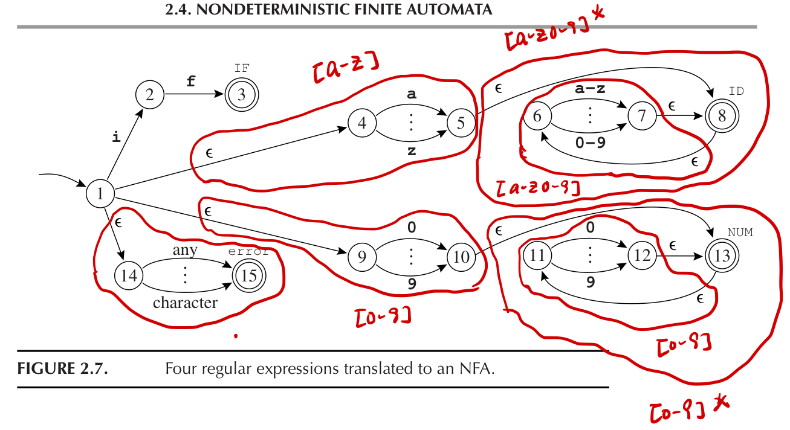

词法分析

The front end of the compiler performs analysis; the back end does synthesis.

+ Lexical analysis: breaking the input into individual words or “tokens”; 
+ Syntax analysis: parsing the phrase structure of the program; and
+ Semantic analysis: calculating the program’s meaning

+ Input: A Stream of characters
+ Output: A Stream of names, keywords, and punctuation marks

# Lexical Tokens

> A programming language classifies lexical tokens into a finite set of token types.

Token Types

NonTokens
+ comment
+ preprocessor directive
+ macro
+ blanks, tabs, newlines

some of the tokens, such as
+ identifiers and literals
+ `ID(match0)`/`NUM(3)`
+ have *semantic values* (*lexeme*) attached to them, giving auxiliary information in addition to the token type.

最终目标，得到Token-Lexeme Pair。

## How to write Lexical Analyzers?
+ How to describe a lexical token?
	+ _regular expressions_
+ How to implement lexers?
	+ *DFT(deterministic finite automata)*

# Regular Expressions

Each regular expression stands for a set of strings

+ Symbol: `a` means string a
+ Alternation: `M|N`
+ Concatenation: `M·N` Concat M and N
+ Epsilon: empty string
+ Repetition: `M*`, zero or more strings

## Abbreviations
+ omit the `concatenation symbol` or the `epsilon`
+ `[abcd]` means `a|b|c|d`
+ `M?` means `M | epsilon`
+ `M+` means `M·M*`

## Disambiguation Rule
+ __Longest match__: The longest initial substring of the input that can match any regular expression is taken as the next token.
	+ 有时候语义不明，没法判断子是不是。
+ __Rule priority__: For a particular longest initial substring, the first regular expression that can match determines its token type. This means that the order of writing down the regular-expression rules has significance.

只用DFA不太行，加了规则，变成图灵机了。
出错也当Token

# Finite Automata

## DFA(Derterministic Finite Automata)
+ One transition per input per state
+ No $\epsilon$ moves

We can encode this machine as a transition matrix

Recognizing The Longest Match
.png)

## Nondeterministic finite automata

A nondeterministic finite automaton (NFA) is one that has a choice of **edges – labeled with the same symbol** – to follow out of a state.

+ edges labeled with the same symbol
+ Special Edges with $\epsilon$，不拿symbol但是走

接收二的整数倍或者三的整数倍

### 将Regular Expression转换为NFA

+ Regular Expression
	+ Tail ：开始边
	+ Head：终止状态
	+ 
+ 组合NFA

### Converting an NFA to a DFA

假设输入是`in`

+ at this point the NFA might take any of them, so it is in one of the states {1, 4, 9, 14}; 
	+ that is, we compute the **ϵ-closure** of {1}.
+ From state 1 we can reach 2, from 4 we reach 5, from 9 we go nowhere, and from 14 we reach 15.
+ So we have the set {2, 5, 15}. But again we must compute **ϵ-closure**

### ϵ-closure
Let edge(s, c) be the set of all NFA states reachable by following a single edge with label c from state s.

For a set of states S, closure(S) is the set of states that can be reached from a state in S without consuming any of the input, that is, by going only through ϵ edges.

Since the NFA has a finite number n of states, the DFA will also have a finite number (at most $2^n$) of states.

n个状态的集合，有$2^n$的子集。

This is extremely important, because in principle the DFA has 2n states, but in practice we usually find that only about n of them are reachable from the start state.

实现优先级策略
A state d is final in the DFA if any NFA-state in states[d] is final in the NFA. Labeling a state final is not enough; we must also
+ say what token is recognized; 
+ we label d with the token-type that **occurred first in the list of regular expressions** that constitute the lexical specification.

After the DFA is constructed, the “states” array may be discarded, and the “trans” array is used for lexical analysis.
.png)